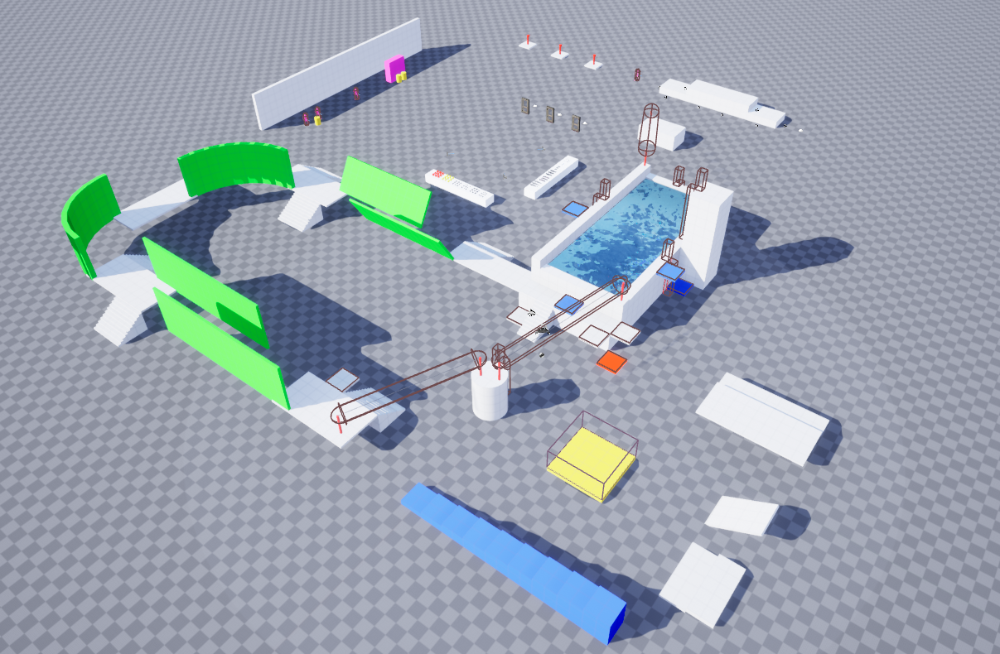

# UE4 Study Project Demo

Hello! I started working on this study project as a part of an Unreal Engine 4 course ([XYZ School](https://www.school-xyz.com/main_eng)) in the beginning of 2024. Using the knowledge gained during the course and my independent learning, I improved it and extended most of the features.

Implemented features:
- Character movement
- Character camera and animations
- Character abilities integrated and replicated using GAS
- Equipment and inventory systems
- Player HUD and inventory/equipment UI
- Full character replication and its inventory
- Simple turret and character AI
- Game saves and level streaming
- Online subsystem

Code samples:  
[BaseCharacter.h](https://github.com/Neolias/u4-study-project-demo/blob/main/ue4/Source/XyzHomework/Characters/XyzBaseCharacter.h)  
[BaseCharacter.cpp](https://github.com/Neolias/u4-study-project-demo/blob/main/ue4/Source/XyzHomework/Characters/XyzBaseCharacter.cpp)  
[CharacterMovement.h](https://github.com/Neolias/u4-study-project-demo/blob/main/ue4/Source/XyzHomework/Components/MovementComponents/XyzBaseCharMovementComponent.h)  
[CharacterMovement.cpp](https://github.com/Neolias/u4-study-project-demo/blob/main/ue4/Source/XyzHomework/Components/MovementComponents/XyzBaseCharMovementComponent.cpp)  
[EquipmentComponent.h](https://github.com/Neolias/u4-study-project-demo/blob/main/ue4/Source/XyzHomework/Components/CharacterComponents/CharacterEquipmentComponent.h)  
[EquipmentComponent.cpp](https://github.com/Neolias/u4-study-project-demo/blob/main/ue4/Source/XyzHomework/Components/CharacterComponents/CharacterEquipmentComponent.cpp)  

See the latest debug build here: [Releases]( https://github.com/Neolias/ue4-study-project-demo/releases)  
Old recording showcasing some of the mechanics: [YouTube](https://www.youtube.com/watch?v=TFxdaA3Rt28)

## Controls
*Movement:*  
**WASD:** Movement (Walking, Swimming, Climbing ladders)  
**Shift:** Sprint  
**Shift + Ctrl (or Ctrl if sprinting):** Slide  
**Ctrl:** Crouch / Swim Down  
**Ctrl + Ctrl (or Ctrl if crouching):** Prone  
**Space:** Jump / Swim Up / UnCrouch / UnProne / Mantle / Use Ladders and Ziplines  

*Equipment:*  
**RMB:** Aim / Secondary Melee Attack  
**LMB:** Shoot (Can shoot only while aiming) / Primary Melee Attack  
**Scroll Wheel:** Change Weapons  
**Q:** Toggle Primary Item (Grenade)  
**Q + LMB (or LMB if equipped):** Throw Grenade  
**E:** Change Weapon Mode (Currently only Rifle has modes)  
**R:** Reload Current Weapon  

*UI:*  
**F:** Use Smart Object (Pickup items, Doors) 
**I:** Toggle Inventory  
**X:** Radial Menu  
**TAB:** Online Sessions Menu
**Z:** Toggle Mouse Cursor  

*Other:*  
**L:** Reload Current Level (Only in a standalone game)  
**T:** Quick Save (Only in a standalone game)  
**Y:** Quick Load (Only in a standalone game)  
**ESC:** Quit the Game

## Console Commands
*EnableDebugCategory CharacterAttributes 1*  
*EnableDebugCategory AIAttributes 1*  
*EnableDebugCategory RangedWeapon 1*  
*EnableDebugCategory MeleeWeapon 1*  
